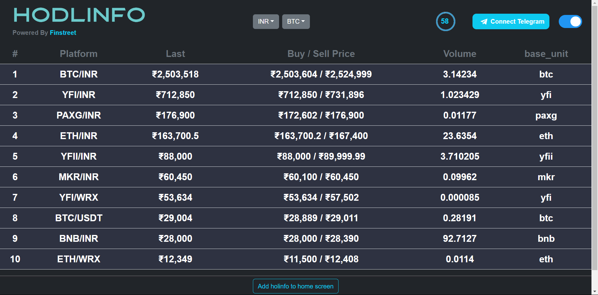

# Assignment Task for Internship

### Instructions:
- You have to create this webpage hodlinfo.com by using HTML and CSS and backend using node js.

- Fetch top 10 results from API(https://api.wazirx.com/api/v2/tickers) in your Nodejs express server and store name, last, buy, Sell, volume, base_unit of all top 10 results in the database (you can use any database(Preferable PostgreSQL)).
Then create a route using express to get the above stored data from the database to the frontend.

## Screenshots

[App Recording](https://www.awesomescreenshot.com/video/17169521?key=d5c7a9b50b6ef6270fcca241f9f42ab1)



## Installation

Use the package manager [npm](https://www.npmjs.com/) to install all the dependencies.

```bash
npm install
```

## Usage

```bash
npm start
```
